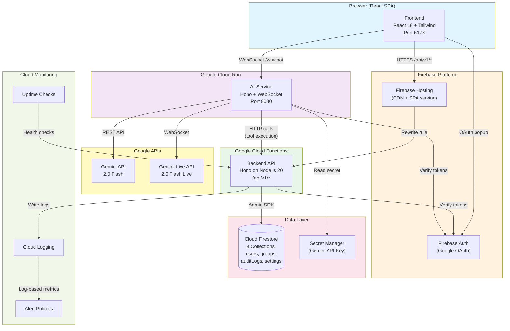
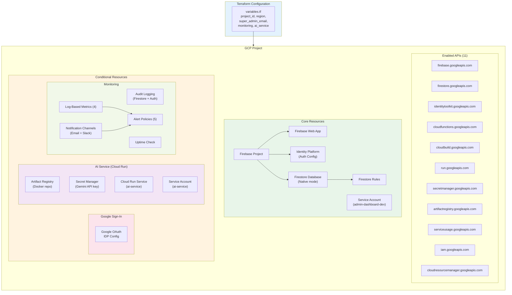
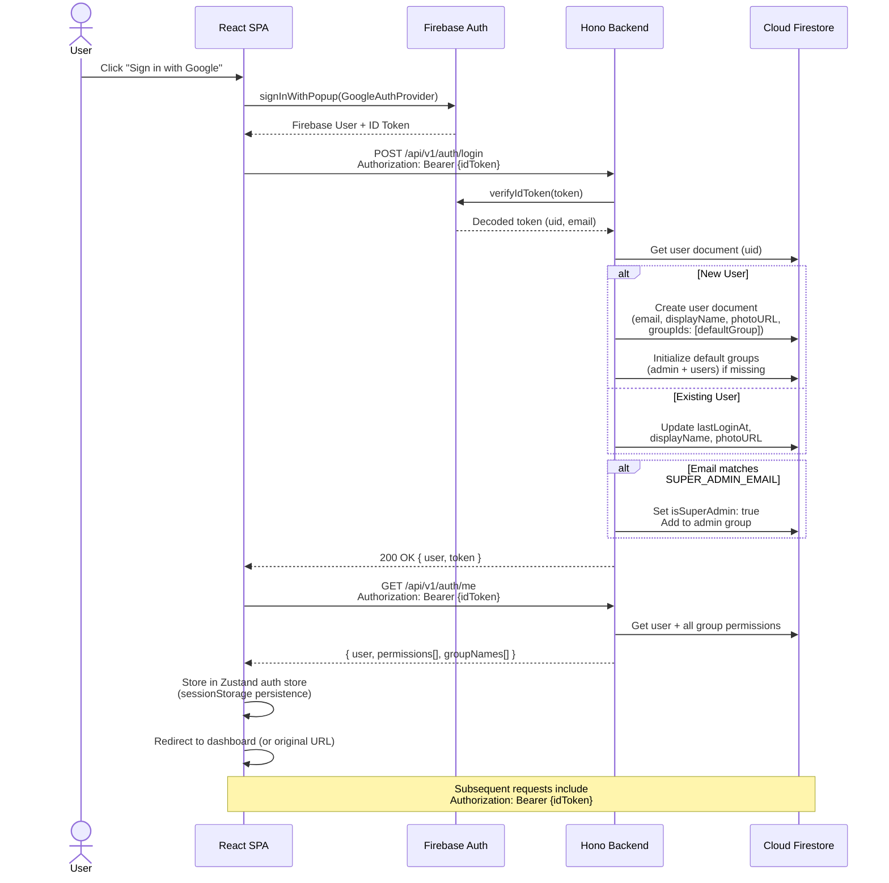
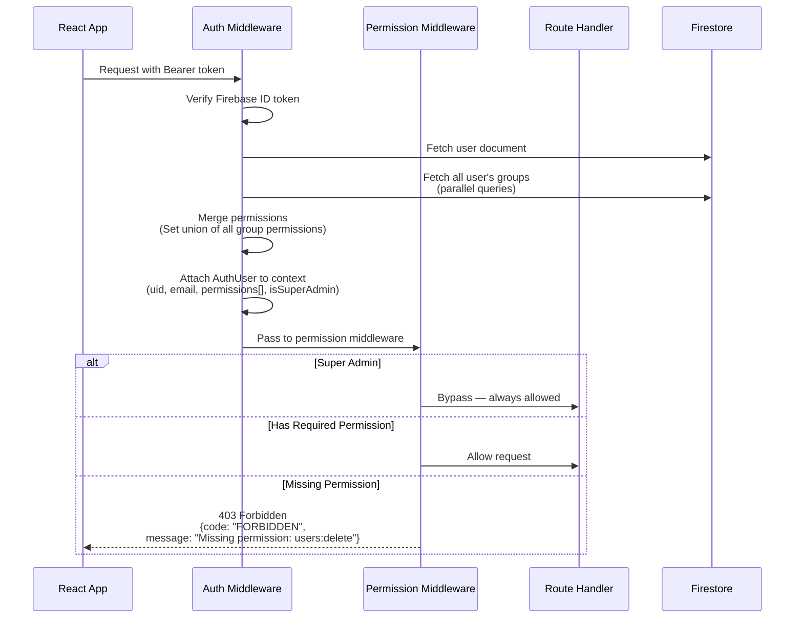
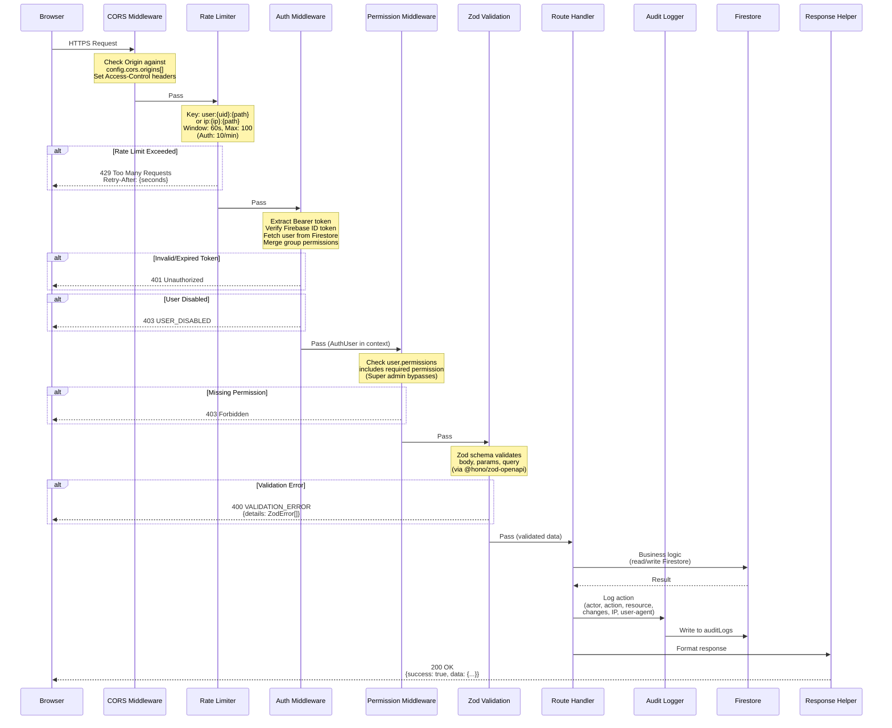
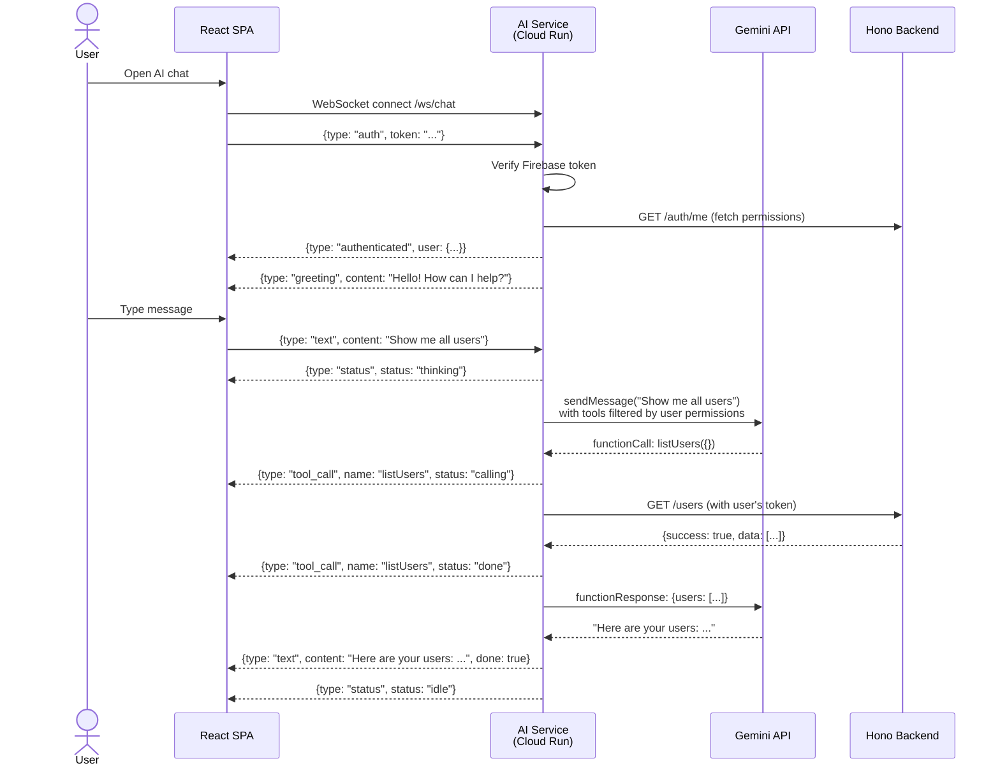

# Architecture Document

> **Purpose**: Comprehensive technical reference for the Admin Dashboard Template. Detailed enough for automated documentation tools (e.g., NotebookLM) to generate summaries, walkthroughs, and video content.

---

## Table of Contents

1. [Executive Summary](#1-executive-summary)
2. [Tech Stack Overview](#2-tech-stack-overview)
3. [System Architecture](#3-system-architecture)
4. [Infrastructure (GCP + Terraform)](#4-infrastructure-gcp--terraform)
5. [Authentication Flow](#5-authentication-flow)
6. [Authorization & Permission System](#6-authorization--permission-system)
7. [API Request Lifecycle](#7-api-request-lifecycle)
8. [Database Design](#8-database-design)
9. [Backend Architecture](#9-backend-architecture)
10. [Frontend Architecture](#10-frontend-architecture)
11. [AI Service Architecture](#11-ai-service-architecture)
12. [Libraries, Frameworks & Design Philosophy](#12-libraries-frameworks--design-philosophy)
13. [Project Structure](#13-project-structure)
14. [Terraform Resources](#14-terraform-resources)
15. [Deployment & Operations](#15-deployment--operations)
16. [Security Model](#16-security-model)

---

## 1. Executive Summary

### What Is This?

The **Admin Dashboard Template** is a production-ready, reusable foundation for building B2C and B2B SaaS administration interfaces. It provides user management, group-based permissions, audit logging, application settings, and an AI assistant — all deployable to Google Cloud Platform with a single Terraform command.

### Who Is It For?

- **Developers** building SaaS products who need a fully functional admin panel on day one
- **Teams** that want Google OAuth authentication, role-based access control, and audit trails without building from scratch
- **Organizations** that need a template they can fork, customize, and deploy independently

### Key Capabilities

| Capability | Description |
|---|---|
| **User Management** | List, search, create, update, disable, enable, delete users with multi-group assignments |
| **Group Management** | Create permission groups, assign granular permissions, set default groups |
| **Permission System** | 12 built-in permissions across 4 resources, extensible with custom permissions |
| **Audit Logging** | Every admin action logged with actor, action, resource, timestamp, and before/after diffs |
| **AI Assistant** | Text and voice chat powered by Gemini, with permission-aware tool calling |
| **Infrastructure as Code** | Full GCP deployment via Terraform: Firebase, Cloud Functions, Firestore, Cloud Run, monitoring |
| **Template System** | Fork-and-customize architecture with upstream sync for core updates |

### Architecture at a Glance

The system is a **monorepo with three packages** (shared, backend, frontend) plus an optional AI service. The backend runs on Firebase Cloud Functions (Hono framework), the frontend is a React SPA hosted on Firebase Hosting, and the AI service runs on Cloud Run. All data lives in Firestore. Authentication uses Google OAuth via Firebase Auth.

---

## 2. Tech Stack Overview

| Layer | Technology | Version | Purpose |
|---|---|---|---|
| **Runtime** | Bun | Latest | Package manager, bundler, test runner, dev server |
| **Frontend Framework** | React | 18.2.0 | UI component library |
| **Routing** | React Router | 6.22.0 | Client-side routing with data loaders |
| **State Management** | Zustand | 4.5.0 | Lightweight stores (auth, theme, AI chat) |
| **Server State** | TanStack Query | 5.17.19 | Data fetching, caching, mutations |
| **Tables** | TanStack Table | 8.21.3 | Headless table rendering with sorting, selection |
| **Forms** | React Hook Form | 7.50.1 | Form state management with Zod validation |
| **Validation** | Zod | 3.22–3.23 | Schema validation (shared across frontend/backend) |
| **CSS Framework** | Tailwind CSS | 3.4.1 | Utility-first styling |
| **UI Components** | shadcn/ui + Radix UI | Latest | Accessible, composable primitives |
| **Icons** | Lucide React | 0.323.0 | Icon library |
| **Backend Framework** | Hono | 4.6.0 | Lightweight web framework for Cloud Functions |
| **API Documentation** | @hono/zod-openapi | 0.18.0 | OpenAPI spec generation from Zod schemas |
| **Database** | Cloud Firestore | — | NoSQL document database |
| **Authentication** | Firebase Auth | 10.8.0 (client) / 12.7.0 (admin) | Google OAuth provider |
| **Cloud Functions** | Firebase Functions | 7.0.5 | Serverless backend runtime (Node.js 20) |
| **AI Models** | Google Gemini | 2.0 Flash | Text chat and voice interaction |
| **AI SDK** | @google/generative-ai | 0.21.0 | Gemini API client |
| **Linting** | Biome | Latest | Linter + formatter (replaces ESLint + Prettier) |
| **IaC** | Terraform | >= 1.0 | Infrastructure provisioning for GCP |
| **Cloud Provider** | Google Cloud Platform | — | Hosting, compute, storage, monitoring |

---

## 3. System Architecture

### Diagram



> **[View in Mermaid Live Editor](https://mermaid.live)** — Paste the diagram code above to interact with it.

### Data Flow Summary

1. **Browser** loads the React SPA from Firebase Hosting (CDN-backed)
2. **Authentication**: User clicks "Sign in with Google" → Firebase Auth popup → returns ID token
3. **API calls**: Frontend sends HTTPS requests to `/api/v1/*` → Firebase Hosting rewrites to Cloud Functions → Hono backend processes request
4. **AI chat**: Frontend opens WebSocket to Cloud Run AI service → authenticates with Firebase token → sends text/audio → AI service calls Gemini → executes tools via backend API → streams response back
5. **Data**: All state stored in Firestore. Backend uses Admin SDK (bypasses security rules). Frontend never writes directly.
6. **Monitoring**: Cloud Logging captures function logs → log-based metrics trigger alert policies → notifications via email/Slack

---

## 4. Infrastructure (GCP + Terraform)

### Diagram



### Resource Summary

The Terraform configuration provisions **20+ GCP resources** organized into:

- **Core** (always created): Firebase project, web app, Identity Platform, Firestore database + security rules, development service account
- **Google Sign-In** (conditional on `enable_google_signin`): Google OAuth Identity Provider configuration
- **AI Service** (conditional on `ai_service.enabled`): Artifact Registry, Secret Manager, Cloud Run service, dedicated service account
- **Monitoring** (conditional on `monitoring.enabled`): Cloud audit logs, 4 log-based metrics, notification channels, 5 alert policies, uptime check

See [Section 14: Terraform Resources](#14-terraform-resources) for the complete resource inventory.

---

## 5. Authentication Flow

### Diagram



### Step-by-Step Explanation

1. **Google OAuth Popup**: The React app calls `signInWithPopup()` with `GoogleAuthProvider`. Firebase handles the OAuth flow entirely.
2. **Token Acquisition**: Firebase returns a Firebase User object. The app extracts an ID token (JWT signed by Google).
3. **Backend Login**: The app sends the ID token to `POST /auth/login`. The backend verifies the token using Firebase Admin SDK.
4. **User Upsert**: If the user doesn't exist in Firestore, a new document is created with default group assignments. If the user exists, their last login time and profile info are updated.
5. **Super Admin Check**: On every login, the backend checks if the user's email matches `SUPER_ADMIN_EMAIL`. If so, the user gets `isSuperAdmin: true` and is added to the admin group.
6. **Permission Fetch**: The app calls `GET /auth/me` to get the full user profile including merged permissions from all assigned groups.
7. **Client State**: User data (including permissions and group memberships) is stored in the Zustand auth store, persisted to `sessionStorage` (excluding permissions and `isSuperAdmin`, which are always fetched fresh).

### Key Design Decisions

- **Google OAuth only** — No email/password authentication. Even in development with emulators, Firebase Auth shows a Google sign-in popup.
- **Super Admin by email** — Determined by `SUPER_ADMIN_EMAIL` environment variable, not by first login or self-registration.
- **Token refresh** — The API client automatically refreshes tokens on 401 responses using `getIdToken(forceRefresh: true)`.
- **Logout** — Calls Firebase `signOut()`, clears the auth store, clears TanStack Query cache (prevents data leaks between sessions), and redirects to `/login`.

---

## 6. Authorization & Permission System

### Permission Model

The system uses a **multi-group, permission-based** authorization model:

```
User → belongs to N Groups → each Group has M Permissions → User's effective permissions = union of all group permissions
```

### Permission Definitions

**Core Permissions** (11 — template infrastructure, defined in `packages/backend/src/core/permissions.ts`):

| Permission | Resource | Action | Description |
|---|---|---|---|
| `users:create` | users | create | Create new users |
| `users:read` | users | read | View user details |
| `users:update` | users | update | Update user information |
| `users:delete` | users | delete | Delete users |
| `users:list` | users | list | View list of users |
| `groups:create` | groups | create | Create new groups |
| `groups:read` | groups | read | View group details |
| `groups:update` | groups | update | Update group information |
| `groups:delete` | groups | delete | Delete groups |
| `groups:list` | groups | list | View list of groups |
| `audit:list` | audit | list | View audit logs |

**Custom Permissions** (defined in `packages/shared/src/constants/permissions.ts`):

| Permission | Resource | Action | Description |
|---|---|---|---|
| `ai:use` | ai | use | Use AI assistant |

Developers add new custom permissions to the `CUSTOM_PERMISSIONS` record. They auto-merge with core permissions and appear in the Group Management UI.

### Default Groups

| Group | ID | System? | Default? | Permissions |
|---|---|---|---|---|
| **Admin** | `admin` | Yes | No | All 12 permissions (core + custom) |
| **Users** | `users` | Yes | Yes | `users:read`, `users:update` |

New users are automatically assigned to the default group on first login. The admin group gets all permissions (including any custom ones added later).

### Permission Resolution



### Permission Middleware Variants

The backend provides four permission middleware factories:

| Factory | Usage | Behavior |
|---|---|---|
| `requirePermission(p)` | Most routes | User must have exactly this permission |
| `requireAnyPermission([p1, p2])` | OR logic | User must have at least one |
| `requireAllPermissions([p1, p2])` | AND logic | User must have all listed permissions |
| `requireSuperAdmin()` | Critical ops | Only super admins pass |

### Frontend Permission Enforcement

The frontend mirrors backend checks for UI rendering (not security — the backend is the authoritative enforcer):

| Component | Purpose |
|---|---|
| `RequireAuth` | Route guard — redirects to `/login` if unauthenticated |
| `RequirePermission` | Route guard — redirects to `/forbidden` if missing permission |
| `PermissionGate` | Conditional render — shows children only if user has permission |
| `WithPermission` | Inline conditional — renders fallback if no permission |
| `withPermission(Comp, perm)` | HOC — wraps component with permission check |

The `usePermissions()` hook provides convenience methods:

```typescript
const { hasPermission, hasAnyPermission, isAdmin, canManageUsers } = usePermissions();
```

---

## 7. API Request Lifecycle

### Middleware Chain

Every API request passes through a defined middleware chain before reaching the route handler:



### Response Format

All API responses follow a consistent envelope:

**Success**:
```json
{
  "success": true,
  "data": { ... },
  "meta": {
    "page": 1,
    "limit": 20,
    "total": 150,
    "hasMore": true
  }
}
```

**Error**:
```json
{
  "success": false,
  "error": {
    "code": "NOT_FOUND",
    "message": "User not found",
    "details": null
  }
}
```

### Error Codes

| Code | HTTP Status | Description |
|---|---|---|
| `UNAUTHORIZED` | 401 | Missing or invalid authentication |
| `FORBIDDEN` | 403 | Insufficient permissions |
| `INVALID_TOKEN` | 401 | Malformed token |
| `TOKEN_EXPIRED` | 401 | Token has expired |
| `NOT_FOUND` | 404 | Resource doesn't exist |
| `ALREADY_EXISTS` | 409 | Duplicate resource |
| `CONFLICT` | 409 | Conflicting state |
| `VALIDATION_ERROR` | 400 | Request body/params invalid |
| `INVALID_INPUT` | 400 | Bad input data |
| `INTERNAL_ERROR` | 500 | Unexpected server error |
| `SERVICE_UNAVAILABLE` | 503 | Dependent service down |
| `CANNOT_DELETE_SELF` | 403 | Cannot delete own account |
| `CANNOT_DISABLE_SELF` | 403 | Cannot disable own account |
| `CANNOT_MODIFY_SUPER_ADMIN` | 403 | Cannot modify super admin |
| `CANNOT_DELETE_SYSTEM_GROUP` | 403 | System groups are protected |
| `CANNOT_DELETE_DEFAULT_GROUP` | 403 | Default group is protected |
| `GROUP_HAS_USERS` | 400 | Group has members, cannot delete |
| `USER_DISABLED` | 403 | User account is disabled |

---

## 8. Database Design

### Firestore Collections

The application uses 4 Firestore collections. All data is accessed server-side via the Firebase Admin SDK (which bypasses security rules). Firestore security rules provide defense-in-depth for any potential direct client access.

#### `users` Collection

| Field | Type | Required | Description |
|---|---|---|---|
| `id` | string | Yes | Firebase Auth UID (document ID) |
| `email` | string | Yes | User email (lowercased) |
| `displayName` | string | Yes | Full name from Google profile |
| `photoURL` | string \| null | Yes | Google profile photo URL |
| `groupIds` | string[] | Yes | IDs of all assigned groups |
| `isSuperAdmin` | boolean | Yes | Whether this user is super admin |
| `status` | `'active'` \| `'disabled'` | Yes | Account status |
| `disabledAt` | Date | No | When the account was disabled |
| `disabledBy` | string | No | UID of admin who disabled the account |
| `createdAt` | Date | Yes | Account creation timestamp |
| `updatedAt` | Date | Yes | Last modification timestamp |
| `lastLoginAt` | Date | Yes | Last login timestamp |
| `preferences` | object | Yes | `{ theme: 'light' \| 'dark' \| 'system' }` |

**Indexes**:
- `status` ASC + `createdAt` DESC — For listing active/disabled users
- `groupIds` ARRAY_CONTAINS + `createdAt` DESC — For filtering users by group

#### `groups` Collection

| Field | Type | Required | Description |
|---|---|---|---|
| `id` | string | Yes | Auto-generated document ID |
| `name` | string | Yes | Unique group name |
| `description` | string | Yes | Group description |
| `permissions` | string[] | Yes | Assigned permission strings |
| `isDefault` | boolean | Yes | Whether new users join this group |
| `isSystem` | boolean | Yes | Whether this is a system group (cannot delete) |
| `createdAt` | Date | Yes | Creation timestamp |
| `updatedAt` | Date | Yes | Last modification timestamp |
| `createdBy` | string | Yes | UID of creator |
| `updatedBy` | string | Yes | UID of last modifier |

#### `auditLogs` Collection

| Field | Type | Required | Description |
|---|---|---|---|
| `id` | string | Yes | Auto-generated document ID |
| `timestamp` | Date | Yes | When the action occurred |
| `actorId` | string | Yes | UID of the user who performed the action |
| `actorEmail` | string | Yes | Email of the actor |
| `actorName` | string | Yes | Display name of the actor |
| `action` | AuditAction | Yes | What was done (see below) |
| `resource` | AuditResource | Yes | What was acted on (users/groups/settings/auth) |
| `resourceId` | string | Yes | ID of the affected resource |
| `description` | string | Yes | Human-readable description |
| `changes` | object | No | `{ before: {...}, after: {...} }` — state diff |
| `ipAddress` | string | No | Client IP address |
| `userAgent` | string | No | Client user-agent string |

**Audit Actions** (15 total):

| Category | Actions |
|---|---|
| Auth | `LOGIN`, `LOGOUT`, `LOGIN_FAILED` |
| Users | `USER_CREATED`, `USER_UPDATED`, `USER_DISABLED`, `USER_ENABLED`, `USER_DELETED`, `USER_GROUP_ADDED`, `USER_GROUP_REMOVED` |
| Groups | `GROUP_CREATED`, `GROUP_UPDATED`, `GROUP_DELETED`, `GROUP_PERMISSIONS_CHANGED` |
| Settings | `SETTINGS_UPDATED` |

**Indexes**:
- `actorId` ASC + `timestamp` DESC — Logs by actor
- `action` ASC + `timestamp` DESC — Logs by action type
- `resource` ASC + `timestamp` DESC — Logs by resource type
- `resourceId` ASC + `timestamp` DESC — Logs for specific resource

#### `settings` Collection

| Field | Type | Required | Description |
|---|---|---|---|
| `id` | string | Yes | Always `'app'` (singleton document) |
| `appName` | string | Yes | Application display name |
| `defaultGroupId` | string | Yes | Group assigned to new users |
| `features` | object | Yes | Feature flags (see below) |
| `updatedAt` | Date | Yes | Last modification timestamp |
| `updatedBy` | string | Yes | UID of last modifier |

**Feature Flags**:

| Feature | Type | Default | Description |
|---|---|---|---|
| `auditLogging` | boolean | `true` | Enable/disable audit log recording |
| `userRegistration` | boolean | `true` | Allow new user creation |
| `aiAssistant` | `'voice'` \| `'chat'` \| `'disabled'` | `'disabled'` | AI assistant mode |

### Firestore Security Rules

The security rules provide defense-in-depth (the Admin SDK bypasses them, but they protect against any direct client access):

| Collection | Read | Create | Update | Delete |
|---|---|---|---|---|
| `users/{userId}` | Self or Admin | Admin only | Admin or Self (non-sensitive fields) | Admin only (not super admin) |
| `groups/{groupId}` | All active users | Admin only | Admin only | Admin only (not default) |
| `auditLogs/{logId}` | Admin only | **No client writes** | **No client writes** | **No client writes** |
| `settings/{doc}` | All active users | Admin only | Admin only | Admin only |
| Everything else | Deny | Deny | Deny | Deny |

**Protected fields** (users cannot modify on their own profile): `groupIds`, `isSuperAdmin`, `status`.

---

## 9. Backend Architecture

### Framework: Hono

The backend uses [Hono](https://hono.dev), a lightweight web framework that runs on Firebase Cloud Functions (Node.js 20). Hono provides Express-like routing with middleware, but is optimized for edge/serverless environments.

### Application Setup

The Hono app is configured in `packages/backend/src/app.ts`:

1. CORS middleware (origins from `config.cors.origins`)
2. Request ID generation (attached to context)
3. Rate limiting middleware
4. Route registration (all route groups mounted under `/api/v1`)
5. Global error handler (catches AppError, HTTPException, ZodError, Firebase errors)
6. OpenAPI documentation endpoints (`/swagger`, `/doc`)
7. Health check endpoint (`/health`)

### API Routes

#### Authentication (`/api/v1/auth`)

| Method | Path | Middleware | Purpose |
|---|---|---|---|
| POST | `/login` | Rate limit (10/min) | Verify token, create/update user, initialize default groups |
| POST | `/logout` | `authMiddleware` | Log out and record audit |
| GET | `/me` | `authMiddleware` | Get current user with permissions and group names |
| GET | `/verify` | `authMiddleware` | Verify token validity |

#### Users (`/api/v1/users`)

| Method | Path | Middleware | Purpose |
|---|---|---|---|
| GET | `/` | `authMiddleware`, `requirePermission('users:list')` | List users with pagination, search, filters |
| GET | `/:id` | `authMiddleware`, `requirePermission('users:read')` | Get user by ID with permissions |
| PUT | `/:id` | `authMiddleware`, `requirePermission('users:update')` | Update user details |
| DELETE | `/:id` | `authMiddleware`, `requirePermission('users:delete')` | Delete user (not self, not super admin) |
| POST | `/:id/disable` | `authMiddleware`, `requirePermission('users:update')` | Disable user account |
| POST | `/:id/enable` | `authMiddleware`, `requirePermission('users:update')` | Enable user account |
| POST | `/:id/groups/add` | `authMiddleware`, `requirePermission('users:update')` | Add user to a group |
| POST | `/:id/groups/remove` | `authMiddleware`, `requirePermission('users:update')` | Remove user from a group |

#### Groups (`/api/v1/groups`)

| Method | Path | Middleware | Purpose |
|---|---|---|---|
| GET | `/` | `authMiddleware`, `requirePermission('groups:list')` | List groups with user counts and search |
| POST | `/` | `authMiddleware`, `requirePermission('groups:create')` | Create new group |
| GET | `/:id` | `authMiddleware`, `requirePermission('groups:read')` | Get group by ID |
| PUT | `/:id` | `authMiddleware`, `requirePermission('groups:update')` | Update group name/description |
| DELETE | `/:id` | `authMiddleware`, `requirePermission('groups:delete')` | Delete group (not system, not default, no users) |
| GET | `/:id/users` | `authMiddleware`, `requirePermission('groups:read')` | List users in group |
| PUT | `/:id/permissions` | `authMiddleware`, `requirePermission('groups:update')` | Replace group permissions |

#### Permissions (`/api/v1/permissions`)

| Method | Path | Middleware | Purpose |
|---|---|---|---|
| GET | `/` | `authMiddleware` | List all permissions (filtered by user's access) |
| GET | `/my` | `authMiddleware` | Get current user's permissions |
| GET | `/check/:permission` | `authMiddleware` | Check if user has specific permission |
| GET | `/resources` | `authMiddleware` | List permission resource types |

#### Audit Logs (`/api/v1/audit`)

| Method | Path | Middleware | Purpose |
|---|---|---|---|
| GET | `/` | `authMiddleware`, `requirePermission('audit:list')` | List logs with date range, action, resource filters |
| GET | `/stats` | `authMiddleware`, `requirePermission('audit:list')` | Aggregate stats (by action/resource) |
| GET | `/actions` | `authMiddleware`, `requirePermission('audit:list')` | List valid audit actions |
| GET | `/resources` | `authMiddleware`, `requirePermission('audit:list')` | List valid audit resource types |
| GET | `/user/:userId` | `authMiddleware`, `requirePermission('audit:list')` | Logs for specific actor |
| GET | `/resource/:resource/:resourceId` | `authMiddleware`, `requirePermission('audit:list')` | Logs for specific resource |
| GET | `/:id` | `authMiddleware`, `requirePermission('audit:list')` | Get single audit log |

#### Settings (`/api/v1/settings`)

| Method | Path | Middleware | Purpose |
|---|---|---|---|
| GET | `/` | `authMiddleware`, `requirePermission('users:read')` | Get app settings with default group details |
| PUT | `/` | `authMiddleware`, `requireAllPermissions(['users:list', 'users:update'])` | Update settings |
| GET | `/features` | `authMiddleware`, `requirePermission('users:read')` | Get feature flags only |
| PUT | `/features/:feature` | `authMiddleware`, `requireAllPermissions(['users:list', 'users:update'])` | Toggle a feature flag |

#### Utility Endpoints

| Method | Path | Purpose |
|---|---|---|
| GET | `/health` | Returns `{ status: 'healthy', timestamp, version: '1.0.0' }` |
| GET | `/swagger` | Swagger UI (OpenAPI documentation) |
| GET | `/doc` | OpenAPI JSON spec |

### Service Layer

Business logic is encapsulated in singleton services (`packages/backend/src/services/`):

| Service | Key Methods |
|---|---|
| **UserService** | `getUser`, `listUsers`, `createOrUpdateOnLogin`, `updateUser`, `deleteUser`, `disableUser`, `enableUser`, `addUserToGroup`, `removeUserFromGroup` |
| **GroupService** | `listGroups`, `searchGroups`, `createGroup`, `updateGroup`, `deleteGroup`, `updateGroupPermissions`, `initializeDefaultGroups`, `setDefaultGroup` |
| **AuditService** | `createAuditLog`, `listAuditLogs`, `getAuditStats`, `getAuditLogsForResource`, `getAuditLogsForUser`, `cleanupOldLogs` |
| **SettingsService** | `getSettings`, `updateSettings`, `initializeSettings`, `isFeatureEnabled`, `toggleFeature` |

### Configuration

All environment-specific settings in `packages/backend/src/config/index.ts`:

| Setting | Environment Variable | Default |
|---|---|---|
| `cors.origins` | `CORS_ORIGINS` | `["http://localhost:5173", "http://localhost:4173"]` |
| `rateLimit.windowMs` | — | `60000` (1 minute) |
| `rateLimit.max` | — | `100` requests per window |
| `rateLimit.authMax` | — | `10` requests per window |
| `audit.maxHistoryDays` | `AUDIT_MAX_HISTORY_DAYS` | `90` days |
| `superAdminEmail` | `SUPER_ADMIN_EMAIL` | Required |

### Rate Limiting

In-memory rate limiter keyed by `user:{uid}:{path}` (authenticated) or `ip:{ip}:{path}` (unauthenticated):

| Scope | Limit | Window |
|---|---|---|
| General API | 100 requests | 1 minute |
| Auth endpoints (`/auth/login`, `/auth/logout`) | 10 requests | 1 minute |

Response headers: `X-RateLimit-Limit`, `X-RateLimit-Remaining`, `X-RateLimit-Reset`. On 429, includes `Retry-After` header.

---

## 10. Frontend Architecture

### Routing

React Router v6 with data router pattern. All routes defined in `packages/frontend/src/App.tsx`:

```
RootLayout (NavigationProgress + Outlet + Toaster)
├── /login                → Login
└── ProtectedLayout (RequireAuth → AppLayout)
    ├── /                 → Dashboard
    ├── /users            → UserList (requires users:list)
    ├── /users/:id        → UserDetail (requires users:read)
    ├── /groups           → GroupList (requires groups:list)
    ├── /groups/new       → GroupDetail (requires groups:create)
    ├── /groups/:id       → GroupDetail (requires groups:read)
    ├── /audit-logs       → AuditLogs (requires audit:list)
    ├── /profile          → Settings
    ├── /forbidden        → Forbidden (403)
    └── /404              → NotFound (404)
```

### State Management

Three Zustand stores manage client-side state:

#### Auth Store (`core/stores/auth-store.ts`)

```typescript
interface AuthState {
  user: AuthUser | null;       // Current user with permissions
  isAuthenticated: boolean;
  isLoading: boolean;
  isInitialized: boolean;      // True after first auth check
  error: string | null;
}
```

- **Persisted** to `sessionStorage` (excludes permissions and `isSuperAdmin` — always fetched fresh)
- Super admins always return `true` for any permission check
- Supports wildcard permissions (`*`, `resource:*`)

#### Theme Store (`stores/theme-store.ts`)

```typescript
interface ThemeState {
  theme: 'light' | 'dark' | 'system';
  resolvedTheme: 'light' | 'dark';
}
```

- **Persisted** to `localStorage`
- Listens to system `prefers-color-scheme` media query
- Applies theme class to `document.documentElement`

#### AI Chat Store (`stores/ai-chat-store.ts`)

```typescript
interface AiChatState {
  isOpen: boolean;
  isConnected: boolean;
  isAuthenticated: boolean;
  messages: ChatMessage[];
  aiStatus: 'thinking' | 'speaking' | 'listening' | 'idle';
  streamingContent: string;
  error: string | null;
}
```

- **Not persisted** (in-memory only, reset on page refresh)
- Manages WebSocket connection state and message history

### TanStack Query (Server State)

Data fetching uses TanStack Query v5 with a query key factory:

```typescript
const queryKeys = {
  users: {
    all: ['users'],
    list: (params) => ['users', 'list', params],
    detail: (id) => ['users', 'detail', id],
  },
  groups: {
    all: ['groups'],
    list: (params) => ['groups', 'list', params],
    detail: (id) => ['groups', 'detail', id],
  },
  permissions: {
    all: ['permissions'],
    list: () => ['permissions', 'list'],
  },
  auditLogs: {
    all: ['auditLogs'],
    list: (params) => ['auditLogs', 'list', params],
  },
  currentUser: ['currentUser'],
};
```

**Defaults**: 5-minute stale time, 1 retry, no auto-refetch on window focus. Cache is cleared on logout.

**Invalidation pattern**: After mutations, invalidate the `all` key to refetch lists, and the specific `detail` key if applicable.

### API Client

The `AdminDashboardApi` class (`core/api/client.ts`) handles all backend communication:

- **Base URL**: From `PUBLIC_API_BASE_URL` env var (e.g., `/api/v1`)
- **Timeout**: 30 seconds per request
- **Retry**: Up to 3 retries with exponential backoff (1s, 2s, 4s) for GET/HEAD/OPTIONS/PUT on network errors, 5xx, and 429
- **Token management**: Automatically attaches `Authorization: Bearer {token}` header. On 401, force-refreshes the token and retries once.

### Pages

| Page | Component | Key Features |
|---|---|---|
| **Dashboard** | `Dashboard.tsx` | Stats cards (user count, group count, audit count), recent activity feed |
| **Login** | `Login.tsx` | Google OAuth button, theme toggle |
| **User List** | `users/UserList.tsx` | Searchable table, status/group filters, bulk delete, pagination |
| **User Detail** | `users/UserDetail.tsx` | Edit profile, multi-group assignment (add/remove), appearance settings |
| **Group List** | `groups/GroupList.tsx` | Searchable table, member count badges, bulk delete |
| **Group Detail** | `groups/GroupDetail.tsx` | Edit name/description, toggle individual permissions |
| **Audit Logs** | `AuditLogs.tsx` | Date range picker, action/resource filters, detail dialog with JSON diffs |
| **Settings** | `Settings.tsx` | User profile preferences |
| **Forbidden** | `Forbidden.tsx` | 403 error page with back/home buttons |
| **Not Found** | `NotFound.tsx` | 404 error page |

### Shared Feature Components

Reusable components in `components/features/`:

| Component | Purpose |
|---|---|
| `PageHeader` | Simple page title + description |
| `ListHeader` | Title + description + permission-gated create button |
| `SearchFilterBar` | Search input with icon + optional filter children |
| `BulkActionBar` | "N selected" bar with permission-gated delete button |
| `DeleteConfirmationDialog` | Destructive action confirmation dialog |
| `MetadataCard` | Card with icon + label + value rows |
| `PermissionsCard` | Displays permission badges with super admin indicator |
| `NotificationsCard` | Email/push notification toggles (react-hook-form) |
| `AppearanceCard` | Theme selector (light/dark/system) |
| `ErrorStatePage` | Full-page error layout (404, 403) |
| `ThemeToggle` | Light/dark mode toggle button |

### Layout

The `AppLayout` component provides:

- **Desktop sidebar** — Navigation links with icons, permission-gated visibility
- **Mobile sidebar** — Overlay with focus trap and escape key handling
- **Header** — Logo, user profile dropdown, theme toggle, mobile menu button
- **Main content** — Scrollable area with max-width constraint
- **AI chat widget** — Floating button that opens the chat panel

### Build Configuration

The frontend builds with **Bun's bundler** (`packages/frontend/build.ts`):

1. Compile Tailwind CSS to `dist/styles.css`
2. Bundle TypeScript/React with tree-shaking, minification, and code splitting
3. Generate content-hashed filenames for cache busting
4. Inject environment variables via `define` (all `PUBLIC_*` variables)
5. Copy static assets

**Path alias**: `@/*` maps to `src/*` (configured in `tsconfig.json`).

---

## 11. AI Service Architecture

### Overview

The AI service is a standalone Hono server running on Cloud Run that provides an AI assistant with text and voice modes. It connects the frontend to Google Gemini via WebSocket, with permission-aware tool calling that executes admin operations through the backend API.

### WebSocket Protocol



### Message Types

**Client to Server**:

| Type | Fields | Purpose |
|---|---|---|
| `auth` | `token` | Initial Firebase token authentication |
| `text` | `content` | Send text message to AI |
| `audio_chunk` | `data` (base64) | Stream audio data for voice mode |
| `audio_end` | — | Signal end of audio stream |
| `auth_refresh` | `token` | Refresh expired Firebase token |
| `cancel` | — | Cancel ongoing AI response |

**Server to Client**:

| Type | Fields | Purpose |
|---|---|---|
| `authenticated` | `user` | Auth success confirmation |
| `greeting` | `content` | Initial AI greeting |
| `text` | `content`, `done` | AI text response (streaming or complete) |
| `audio_chunk` | `data` (base64) | AI audio response chunk (voice mode) |
| `tool_call` | `name`, `status`, `result?` | Tool execution status updates |
| `error` | `message`, `code?` | Error with optional code |
| `status` | `status` | AI activity (`thinking`, `speaking`, `listening`, `idle`) |

### Session Management

Each WebSocket connection gets a session:

| Property | Value |
|---|---|
| Max duration | 1 hour |
| Rate limit | 30 messages per 60 seconds |
| History | Maintained for session lifetime (Gemini `Content[]` format) |
| Cancellation | Per-message `AbortController` |

### Tool Registry

Tools are **auto-generated at build time** from the backend's OpenAPI spec:

1. `scripts/generate-tools.ts` reads `packages/backend/openapi.json`
2. Each API operation becomes a Gemini function declaration
3. Permissions are inferred from tag + HTTP method (e.g., `users` + GET → `users:read`)
4. Skipped operations: `login`, `logout`, `verifyAuth`, `initializeSettings`

At runtime, `getToolsForUser(permissions, isSuperAdmin)` filters tools to only those the user has permission to use. Super admins see all tools.

### Tool Execution

When Gemini requests a tool call:

1. Look up tool definition by name
2. Extract HTTP method and path from metadata
3. Bind parameters: path params via URL template, query params for GET, JSON body for POST/PUT/DELETE
4. Call the backend API with the user's Firebase token
5. Return the JSON response to Gemini for the next turn

### Gemini Integration

| Feature | Chat Mode | Voice Mode |
|---|---|---|
| Model | `gemini-2.0-flash` | `gemini-2.0-flash-live-001` |
| Protocol | REST (`sendMessage()`) | WebSocket (Gemini Live bidirectional) |
| Response | Complete text + function calls | Streaming audio + text + function calls |
| Voice | N/A | Prebuilt voice "Aoede" |
| Audio format | N/A | PCM 16kHz |

### System Prompt

The AI service uses a hardcoded base prompt that:

- Describes available operations (user/group/settings/audit management)
- Instructs the AI to confirm before destructive operations
- Requires readable summaries instead of raw JSON
- Stays focused on dashboard administration tasks

Dynamic additions include user context (name, email, super admin status) and an optional custom prompt from the `AI_SYSTEM_PROMPT` environment variable.

### Content Filter

Post-processing strips code blocks from AI responses (since the UI doesn't render markdown code blocks well) and provides a fallback message if the filtered response is empty.

---

## 12. Libraries, Frameworks & Design Philosophy

### Why Hono (Backend)?

Hono is a lightweight, TypeScript-first web framework designed for edge/serverless environments. It provides Express-like routing with middleware but is significantly smaller and faster. Key benefits for this project:

- **Cloud Functions compatible** — Works as a single exported function
- **Zod-OpenAPI integration** — Route schemas generate API documentation automatically
- **Middleware ecosystem** — CORS, rate limiting, error handling all built-in
- **Type safety** — Context variables (AuthUser, requestId) are fully typed

### Why Zustand (State)?

Zustand provides simple, hook-based state management without the boilerplate of Redux. Three small stores (auth, theme, AI chat) are easier to reason about than a single global store. Zustand's `persist` middleware handles sessionStorage/localStorage automatically.

### Why TanStack Query (Server State)?

TanStack Query separates server state from client state. It handles caching, background refetching, optimistic updates, and pagination. The 5-minute stale time means most admin operations see cached data, reducing API calls. Cache invalidation on mutations keeps data fresh.

### Why Tailwind + shadcn/ui (Styling)?

Tailwind provides utility-first CSS that co-locates styles with components. shadcn/ui provides pre-built, accessible components based on Radix UI primitives. Unlike component libraries (MUI, Ant Design), shadcn/ui copies components into your project — you own the code and can customize freely.

### Why Bun (Runtime)?

Bun replaces Node.js for development, testing, and building:

- **Fast installs** — Significantly faster than npm/yarn
- **Native bundler** — Replaces Vite/webpack for frontend builds
- **Test runner** — Built-in test runner replaces Jest/Vitest
- **Hot reload** — `--hot` flag for development

Note: Firebase Cloud Functions still run on Node.js 20. Bun is used for development tooling only.

### Why Biome (Linting)?

Biome replaces both ESLint and Prettier with a single, faster tool. It provides linting and formatting with zero configuration needed. Runs significantly faster than ESLint on large codebases.

### Why Firestore (Database)?

Firestore is a natural fit for this use case:

- **Serverless** — No database to provision or manage
- **Real-time capable** — Can add real-time listeners in the future
- **Firebase integration** — Works seamlessly with Firebase Auth and Cloud Functions
- **Free tier** — Sufficient for most admin dashboards
- **Security rules** — Defense-in-depth for data access

### Why Terraform (IaC)?

Terraform manages the entire GCP infrastructure declaratively:

- **Reproducible** — Same config produces same infrastructure
- **Version controlled** — Infrastructure changes are code-reviewed
- **Conditional resources** — Monitoring, AI service, Google Sign-In can be toggled
- **Environment management** — Supports staging/production variants via tfvars

---

## 13. Project Structure

```
admin-dashboard-template/
├── docs/
│   ├── ARCHITECTURE.md         # This document
│   ├── BRD.md                  # Business Requirements Document
│   ├── EXTENDING.md            # How to add features
│   ├── UPGRADING.md            # How to pull template updates
│   └── CONFIGURATION.md        # Environment variables reference
│
├── infrastructure/
│   ├── terraform/
│   │   ├── main.tf             # Provider configuration
│   │   ├── project.tf          # GCP project + Firebase setup
│   │   ├── apis.tf             # API enablement (11 APIs)
│   │   ├── auth.tf             # Identity Platform + Google Sign-In
│   │   ├── firestore.tf        # Firestore database + security rules
│   │   ├── iam.tf              # Service accounts + IAM bindings
│   │   ├── webapp.tf           # Firebase web app + SDK config
│   │   ├── ai-service.tf       # Cloud Run AI service (conditional)
│   │   ├── monitoring.tf       # Logging, metrics, alerts (conditional)
│   │   ├── variables.tf        # Input variables with validation
│   │   ├── outputs.tf          # Output values (Firebase config, URLs)
│   │   └── versions.tf         # Provider version constraints
│   └── scripts/
│       └── setup-terraform.sh  # Interactive setup wizard
│
├── firebase/
│   ├── firestore.rules         # Firestore security rules
│   └── firestore.indexes.json  # Composite indexes
│
├── packages/
│   ├── shared/src/                         # Shared types & utilities
│   │   ├── core/                           # Template infrastructure (don't edit)
│   │   │   ├── types/
│   │   │   │   ├── api.ts                  # ApiResponse, pagination, search params
│   │   │   │   └── permission.ts           # CorePermission, Permission types
│   │   │   └── utils/
│   │   │       ├── permissions.ts          # hasPermission, hasAnyPermission, etc.
│   │   │       └── validation.ts           # isValidEmail, sanitizeDisplayName
│   │   ├── types/                          # Domain types (customizable)
│   │   │   ├── user.ts                     # User, CreateUserInput, UpdateUserInput
│   │   │   ├── group.ts                    # Group, CreateGroupInput, DEFAULT_GROUPS
│   │   │   ├── audit.ts                    # AuditLog, AuditAction, AuditResource
│   │   │   └── settings.ts                # AppSettings, AppFeatures
│   │   └── constants/
│   │       └── permissions.ts              # CUSTOM_PERMISSIONS (add yours here)
│   │
│   ├── backend/src/                        # Hono API on Cloud Functions
│   │   ├── core/                           # Template infrastructure (don't edit)
│   │   │   ├── middleware/
│   │   │   │   ├── auth.ts                 # authMiddleware, optionalAuthMiddleware
│   │   │   │   ├── permissions.ts          # requirePermission, requireAnyPermission, etc.
│   │   │   │   ├── audit.ts               # auditLog, logAuditAction
│   │   │   │   └── rate-limit.ts          # In-memory rate limiter
│   │   │   ├── errors/
│   │   │   │   └── index.ts               # AppError, NotFoundError, ForbiddenError, etc.
│   │   │   ├── utils/
│   │   │   │   └── response.ts            # successResponse, paginatedResponse, errorResponse
│   │   │   ├── lib/
│   │   │   │   └── firebase-admin.ts      # Firebase Admin SDK singleton
│   │   │   ├── permissions.ts             # Core permission definitions + helpers
│   │   │   └── types/
│   │   │       └── context.ts             # AuthUser, AppVariables, AppContext types
│   │   ├── routes/                         # API route handlers (customizable)
│   │   │   ├── auth.ts
│   │   │   ├── users.ts
│   │   │   ├── groups.ts
│   │   │   ├── permissions.ts
│   │   │   ├── audit.ts
│   │   │   └── settings.ts
│   │   ├── services/                       # Business logic (customizable)
│   │   │   ├── user.service.ts
│   │   │   ├── group.service.ts
│   │   │   ├── audit.service.ts
│   │   │   ├── settings.service.ts
│   │   │   └── index.ts                   # Singleton exports
│   │   ├── config/
│   │   │   └── index.ts                   # Runtime configuration
│   │   ├── app.ts                         # Hono app setup + middleware chain
│   │   └── index.ts                       # Cloud Functions entry point
│   │
│   ├── frontend/src/                       # React SPA
│   │   ├── core/                           # Template infrastructure (don't edit)
│   │   │   ├── api/
│   │   │   │   └── client.ts              # AdminDashboardApi class
│   │   │   ├── components/
│   │   │   │   └── permission-gate.tsx    # RequireAuth, RequirePermission, etc.
│   │   │   ├── hooks/
│   │   │   │   ├── useAuth.ts             # Authentication hook
│   │   │   │   └── usePermissions.ts      # Permission checking hook
│   │   │   ├── lib/
│   │   │   │   ├── firebase.ts            # Firebase SDK init + auth helpers
│   │   │   │   └── utils.ts              # cn() class utility
│   │   │   └── stores/
│   │   │       └── auth-store.ts          # Zustand auth store
│   │   ├── pages/                          # Page components (customizable)
│   │   │   ├── Dashboard.tsx
│   │   │   ├── Login.tsx
│   │   │   ├── Settings.tsx
│   │   │   ├── AuditLogs.tsx
│   │   │   ├── Forbidden.tsx
│   │   │   ├── NotFound.tsx
│   │   │   ├── users/
│   │   │   │   ├── UserList.tsx
│   │   │   │   └── UserDetail.tsx
│   │   │   └── groups/
│   │   │       ├── GroupList.tsx
│   │   │       └── GroupDetail.tsx
│   │   ├── components/                     # Shared components (customizable)
│   │   │   ├── layout/
│   │   │   │   ├── app-layout.tsx
│   │   │   │   ├── header.tsx
│   │   │   │   └── sidebar.tsx
│   │   │   ├── features/                  # Reusable feature components
│   │   │   │   ├── page-header.tsx
│   │   │   │   ├── list-header.tsx
│   │   │   │   ├── search-filter-bar.tsx
│   │   │   │   ├── bulk-action-bar.tsx
│   │   │   │   ├── delete-confirmation-dialog.tsx
│   │   │   │   ├── permissions-card.tsx
│   │   │   │   ├── metadata-card.tsx
│   │   │   │   ├── ai-chat/              # AI chat widget components
│   │   │   │   │   ├── ai-chat-widget.tsx
│   │   │   │   │   ├── ai-chat-panel.tsx
│   │   │   │   │   ├── ai-chat-message.tsx
│   │   │   │   │   ├── ai-chat-input.tsx
│   │   │   │   │   ├── ai-chat-tool-status.tsx
│   │   │   │   │   └── ai-chat-voice-indicator.tsx
│   │   │   │   └── ...
│   │   │   └── ui/                        # shadcn/ui primitives
│   │   │       ├── avatar.tsx
│   │   │       ├── badge.tsx
│   │   │       ├── button.tsx
│   │   │       ├── card.tsx
│   │   │       ├── dialog.tsx
│   │   │       ├── dropdown-menu.tsx
│   │   │       ├── form.tsx
│   │   │       ├── input.tsx
│   │   │       ├── select.tsx
│   │   │       ├── table.tsx
│   │   │       └── ...
│   │   ├── stores/
│   │   │   ├── theme-store.ts
│   │   │   └── ai-chat-store.ts
│   │   ├── hooks/
│   │   │   ├── useDebouncedSearch.ts
│   │   │   ├── use-ai-chat.ts
│   │   │   └── useToast.ts
│   │   ├── types/
│   │   │   └── index.ts                   # Query key factory + local interfaces
│   │   ├── App.tsx                        # Route definitions
│   │   ├── main.tsx                       # Entry point
│   │   └── index.css                      # Tailwind + global styles
│   │
│   └── ai-service/                         # AI assistant service (customizable)
│       ├── src/
│       │   ├── index.ts                    # Hono server + WebSocket endpoint
│       │   ├── config/
│       │   │   └── index.ts               # Environment configuration
│       │   ├── auth/
│       │   │   └── verify-token.ts        # Firebase token verification
│       │   ├── ws/
│       │   │   ├── message-types.ts       # WebSocket message type definitions
│       │   │   └── session-manager.ts     # Session lifecycle management
│       │   ├── gemini/
│       │   │   ├── client.ts              # Gemini API client setup
│       │   │   ├── chat-mode.ts           # Text chat processing
│       │   │   └── voice-mode.ts          # Voice streaming via Gemini Live
│       │   ├── guardrails/
│       │   │   ├── system-prompt.ts       # System prompt generation
│       │   │   └── content-filter.ts      # Response post-processing
│       │   └── tools/
│       │       ├── tool-registry.ts       # Permission-filtered tool loading
│       │       ├── tool-executor.ts       # HTTP-based tool execution
│       │       └── generated/
│       │           └── tool-definitions.json  # Auto-generated from OpenAPI
│       ├── scripts/
│       │   └── generate-tools.ts          # OpenAPI → Gemini tool converter
│       ├── Dockerfile                     # Two-stage Bun build
│       ├── build.ts                       # esbuild configuration
│       └── package.json
│
├── scripts/
│   ├── dev.sh                  # Start all dev services
│   ├── dev-ai-service.sh       # Start AI service only
│   ├── init-project.sh         # Rename template for new project
│   └── sync-template.sh        # Pull upstream template updates
│
├── template.json               # Core vs. customizable path manifest
├── firebase.json               # Firebase hosting, functions, emulators config
├── .firebaserc                 # Firebase project aliases
├── package.json                # Root workspace scripts
├── biome.json                  # Biome linter + formatter config
└── CLAUDE.md                   # AI assistant project guidelines
```

### Core vs. Customizable

The `template.json` manifest defines which paths are template infrastructure (updated via `sync-template.sh`) and which are freely customizable:

| Category | Paths | Editable? |
|---|---|---|
| **Core** | `packages/*/src/core/` | No — managed by template upstream |
| **Domain types** | `packages/shared/src/types/`, `packages/shared/src/constants/` | Yes |
| **Routes** | `packages/backend/src/routes/` | Yes |
| **Services** | `packages/backend/src/services/` | Yes |
| **Pages** | `packages/frontend/src/pages/` | Yes |
| **Components** | `packages/frontend/src/components/` | Yes |
| **AI Service** | `packages/ai-service/` (entire package) | Yes |

---

## 14. Terraform Resources

### Complete Resource Inventory

#### API Enablement

| Resource Type | Name | Configuration |
|---|---|---|
| `google_project_service` | `bootstrap` (x3) | `firebase`, `serviceusage`, `iam` APIs |
| `time_sleep` | `wait_for_apis` | 30-second delay for API propagation |
| `google_project_service` | `apis` (x8) | `firestore`, `identitytoolkit`, `cloudfunctions`, `cloudbuild`, `run`, `secretmanager`, `artifactregistry`, `cloudresourcemanager` |

#### Project & Firebase

| Resource Type | Name | Configuration |
|---|---|---|
| `google_project` | `new` | Conditional (`create_project = true`). Labels: `firebase = enabled` |
| `google_firebase_project` | `default` | Enables Firebase on the GCP project |
| `google_firebase_web_app` | `default` | Firebase web app. Deletion policy: `DELETE` |

#### Authentication

| Resource Type | Name | Configuration |
|---|---|---|
| `google_identity_platform_config` | `default` | Auto-delete anonymous users after 30 days. No email/password. No duplicate emails. |
| `google_identity_platform_default_supported_idp_config` | `google` | Conditional (`enable_google_signin && oauth_client_id != null`). Google OAuth provider. |

#### Firestore

| Resource Type | Name | Configuration |
|---|---|---|
| `google_firestore_database` | `default` | Native mode. Pessimistic concurrency. Location: `var.region`. Deletion: ABANDON. |
| `google_firebaserules_ruleset` | `firestore` | Loaded from `firebase/firestore.rules` |
| `google_firebaserules_release` | `firestore` | Deploys ruleset to `cloud.firestore` |

#### IAM

| Resource Type | Name | Configuration |
|---|---|---|
| `google_service_account` | `dev` | ID: `admin-dashboard-dev`. For local development. |
| `google_project_iam_member` | `dev_datastore` | Role: `roles/datastore.user` |
| `google_project_iam_member` | `dev_firebase` | Role: `roles/firebase.sdkAdminServiceAgent` |

#### AI Service (Conditional: `ai_service.enabled`)

| Resource Type | Name | Configuration |
|---|---|---|
| `google_artifact_registry_repository` | `ai_service` | Docker format. Location: `var.region`. |
| `google_secret_manager_secret` | `gemini_api_key` | Auto replication. |
| `google_secret_manager_secret_version` | `gemini_api_key` | Created if `gemini_api_key != ""`. |
| `google_cloud_run_v2_service` | `ai_service` | 1 CPU, 512Mi. Session affinity. Scales 0 to `max_instances`. Port 8080. |
| `google_service_account` | `ai_service` | ID: `ai-service`. |
| `google_project_iam_member` | `ai_service_secret` | Role: `roles/secretmanager.secretAccessor` |
| `google_cloud_run_v2_service_iam_member` | `ai_service_public` | `allUsers` with `roles/run.invoker` |

#### Monitoring (Conditional: `monitoring.enabled`)

| Resource Type | Name | Configuration |
|---|---|---|
| `google_project_service` | `logging`, `monitoring` | API enablement |
| `google_project_iam_audit_config` | `firestore_audit` | Service: `datastore.googleapis.com` |
| `google_project_iam_audit_config` | `identity_audit` | Service: `identitytoolkit.googleapis.com` |
| `google_logging_metric` | `auth_failures` | Auth error log filter |
| `google_logging_metric` | `function_errors` | Cloud Function error filter |
| `google_logging_metric` | `firestore_errors` | Firestore error filter |
| `google_logging_metric` | `high_latency` | Request latency above threshold |
| `time_sleep` | `wait_for_metrics` | 60-second delay for metric registration |
| `google_monitoring_notification_channel` | `email` | Email to `super_admin_email` (or override) |
| `google_monitoring_notification_channel` | `slack` | Conditional: Slack webhook URL |
| `google_monitoring_alert_policy` | `auth_failure_alert` | Threshold: 10 in 300s. Resource: `global`. |
| `google_monitoring_alert_policy` | `function_error_alert` | Threshold: 5 in 300s. Resource: `cloud_function`. |
| `google_monitoring_alert_policy` | `firestore_error_alert` | Threshold: 5 in 300s. Resource: `global`. |
| `google_monitoring_alert_policy` | `latency_alert` | Threshold: 10 req > 5s in 300s. Resource: `cloud_function`. |
| `google_monitoring_uptime_check_config` | `api_health` | Conditional: HTTPS check on `api_domain`. Period: 300s. |
| `google_monitoring_alert_policy` | `uptime_alert` | Triggers if uptime check fails. |

### Terraform Variables

| Variable | Type | Default | Required |
|---|---|---|---|
| `project_id` | string | — | Yes |
| `super_admin_email` | string | — | Yes |
| `project_name` | string | `"Admin Dashboard"` | No |
| `region` | string | `"us-central1"` | No |
| `create_project` | bool | `false` | No |
| `billing_account` | string | `null` | Only if `create_project` |
| `org_id` | string | `null` | No |
| `enable_google_signin` | bool | `false` | No |
| `oauth_client_id` | string | `null` | No |
| `oauth_client_secret` | string (sensitive) | `null` | No |
| `monitoring` | object | Enabled with defaults | No |
| `ai_service` | object | Disabled | No |

---

## 15. Deployment & Operations

### Development Setup

```bash
# 1. Clone and install
git clone <repo-url>
cd admin-dashboard-template
bun install

# 2. Infrastructure (one-time)
cd infrastructure/terraform
cp terraform.tfvars.example terraform.tfvars
# Edit terraform.tfvars with your project_id and super_admin_email
../../infrastructure/scripts/setup-terraform.sh

# 3. Create service account key
gcloud iam service-accounts keys create ./service-account.json \
  --iam-account=admin-dashboard-dev@${PROJECT_ID}.iam.gserviceaccount.com

# 4. Start development
bun run dev:full    # Firebase emulators + backend + frontend
# Or with AI service:
bun run dev:ai      # All of the above + AI service
```

### Development Ports

| Service | Port | URL |
|---|---|---|
| Frontend (Bun dev server) | 5173 | http://localhost:5173 |
| Firebase Emulator UI | 4000 | http://localhost:4000 |
| Backend (Cloud Functions emulator) | 5001 | http://localhost:5001 |
| Firestore emulator | 8080 | http://localhost:8080 |
| Auth emulator | 9099 | http://localhost:9099 |
| Firebase Hosting emulator | 5000 | http://localhost:5000 |
| AI Service | 3001 | http://localhost:3001 |

### Production Build & Deploy

```bash
# Build all packages
bun run build       # Backend (esbuild) + Frontend (Bun bundler)

# Deploy to Firebase
firebase deploy     # Hosting + Functions + Firestore rules

# Or deploy individually
firebase deploy --only hosting
firebase deploy --only functions
firebase deploy --only firestore
```

### Firebase Hosting Configuration

From `firebase.json`:

- **Hosting**: Serves from `packages/frontend/dist`
- **Rewrites**: `/api/**` → Cloud Function `api`; everything else → `index.html` (SPA)
- **Caching**: `index.html` = no-cache; JS/CSS/images = 1 year immutable (content-hashed filenames)
- **Functions**: Source at `packages/backend`, Node.js 20 runtime
- **Pre-deploy**: Strips dev dependencies; post-deploy restores them

### AI Service Deployment

The AI service deploys separately to Cloud Run:

```bash
# Build Docker image
cd packages/ai-service
docker build -t ai-service -f Dockerfile ../..

# Tag and push to Artifact Registry
docker tag ai-service ${REGION}-docker.pkg.dev/${PROJECT_ID}/ai-service/ai-service:latest
docker push ${REGION}-docker.pkg.dev/${PROJECT_ID}/ai-service/ai-service:latest

# Terraform manages the Cloud Run service configuration
```

### Template Operations

**Fork for new project**:
```bash
./scripts/init-project.sh my-app @mycompany
# Renames admin-dashboard-template → my-app and @admin-dashboard → @mycompany
```

**Pull upstream updates**:
```bash
./scripts/sync-template.sh
# Fetches template upstream and shows diff of core/ path changes
# You review and merge selectively
```

---

## 16. Security Model

### Defense in Depth

The application implements security at multiple layers:

```
Layer 1: Firestore Security Rules
  ↓ (if client accesses Firestore directly — not normal flow)
Layer 2: Backend Middleware Chain
  ↓ CORS → Rate Limit → Auth → Permission → Validation
Layer 3: Business Logic Guards
  ↓ Super admin protection, self-action prevention, group constraints
Layer 4: Frontend Permission Gates
  ↓ UI elements hidden/disabled based on permissions (UX only, not security)
Layer 5: AI Service Guardrails
  ↓ Permission-filtered tools, system prompt constraints, content filtering
```

### Layer 1: Firestore Security Rules

- Default deny on all paths
- Admin detection via `groupIds` array or `isSuperAdmin` flag
- Users can only read/update their own non-sensitive fields
- Audit logs are write-protected (no client writes — server Admin SDK only)
- Super admins cannot be deleted
- Default groups cannot be deleted

### Layer 2: Backend Middleware

- **CORS**: Only configured origins can make requests
- **Rate limiting**: Per-user/per-IP limits prevent abuse (100/min general, 10/min auth)
- **Authentication**: Firebase ID token verification on every request
- **Permission checking**: Route-level permission requirements
- **Input validation**: Zod schemas validate all request bodies and parameters

### Layer 3: Business Logic Guards

- Super admins cannot be modified or deleted by non-super-admins
- Users cannot delete or disable themselves
- System groups (`admin`, `users`) cannot be deleted
- Default groups cannot be deleted
- Groups with active members cannot be deleted
- Users must belong to at least one group

### Layer 4: Frontend Permission Gates

- `RequireAuth` — Redirects unauthenticated users to login
- `RequirePermission` — Redirects unauthorized users to forbidden page
- `PermissionGate` — Conditionally renders UI elements based on permissions
- Navigation links hidden for inaccessible pages
- Action buttons disabled/hidden without required permissions

### Layer 5: AI Service Guardrails

- Users only see tools matching their permissions (super admins see all)
- System prompt instructs AI to confirm before destructive operations
- Tool calls execute with the user's Firebase token (backend enforces their permissions)
- Content filter strips code blocks from responses
- Session rate limit: 30 messages per 60 seconds
- Session timeout: 1 hour maximum

### Sensitive Data Protection

- Service account keys (`.json`) are in `.gitignore`
- Environment variables with secrets use Terraform `sensitive = true`
- Gemini API key stored in Secret Manager (not environment variable)
- OAuth client secret marked as sensitive in Terraform
- Super admin email never exposed in API responses
- Firestore security rules prevent reading other users' data

---

*This document was generated from a comprehensive analysis of the Admin Dashboard Template codebase. For the latest information, always refer to the source code and the [BRD](./BRD.md).*
